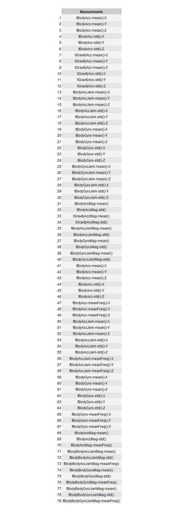

## Project assignment of getting and cleaning data course.

###The file is Code book contains the variable names of  *"tidy.txt"*

1.  **subject**

  	*The experiments have been carried out with a group of 30 volunteers within an age bracket of 19-48 years.*

2.  **activity** 
	
	+     "WALKING"
	+     "WALKING_UPSTAIRS"
	+     "WALKING_DOWNSTAIRS"
	+     "SITTING"
	+     "STANDING"
	+     "LAYING"

    *Each person (subject/volunteers) performed above six activities  wearing a smartphone (Samsung Galaxy S II) on the waist.*
     
	
3.  **Measurements on the mean and standard deviation**
      
      

